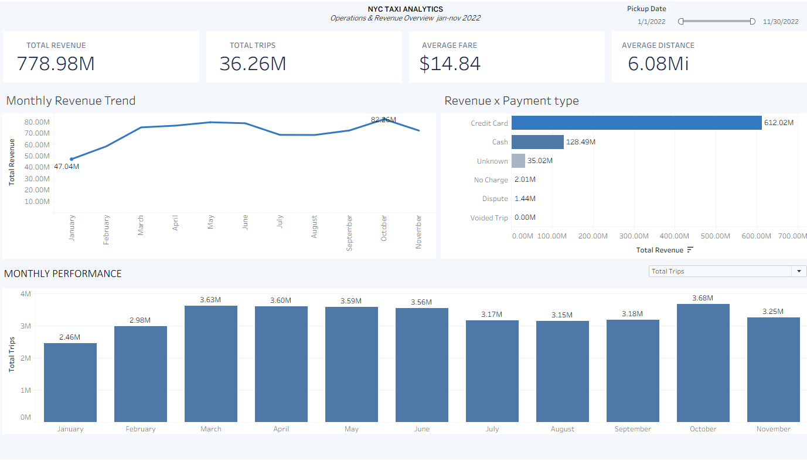
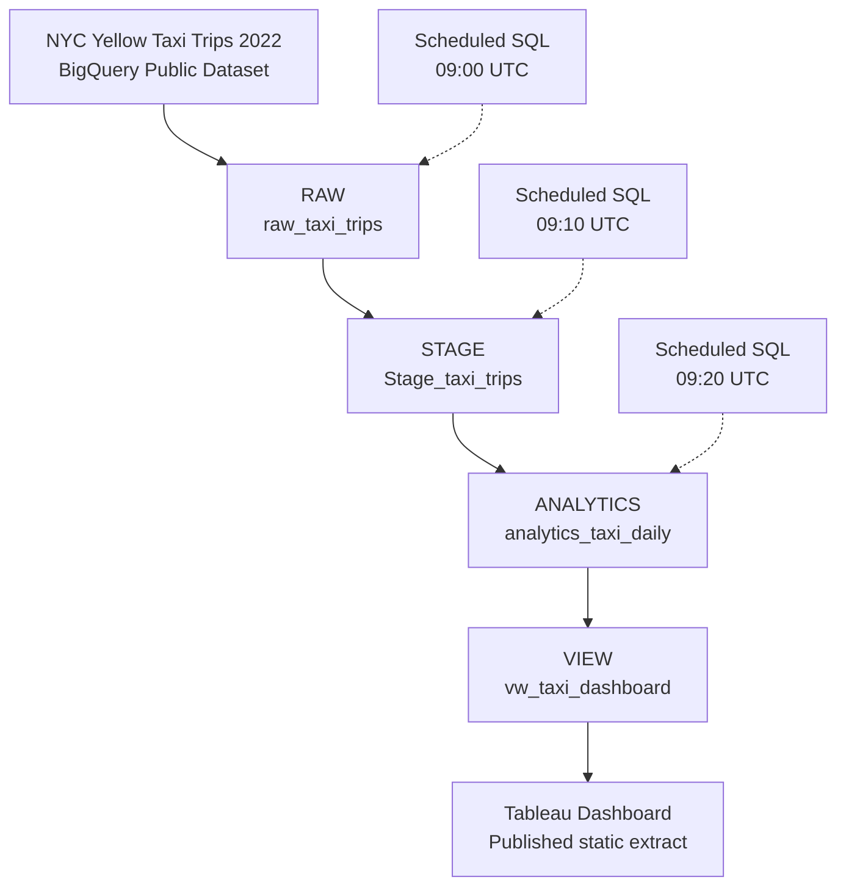

# NYC Taxi Analytics | End-to-End Data Pipeline & BI Dashboard

**Google BigQuery · SQL · Google Cloud Platform · Tableau**

[**Explore the Interactive Tableau Dashboard**](https://public.tableau.com/app/profile/raphael.queiroz.cotta/viz/NYC_Taxi_Analytics_17914847769430/Dash)

## Project Overview

This project demonstrates an end-to-end analytics workflow using New York City taxi trip data. It covers data ingestion, transformation, quality validation, incremental processing, analytical modeling, and interactive business intelligence.

The goal was to transform a large public dataset into a structured, reusable analytics layer that supports operational and revenue analysis.

**Dataset scope:** Approximately 36.26 million taxi trips from 2022.

## Technology Stack

| Technology | Purpose |
|---|---|
| Google Cloud Platform | Cloud infrastructure |
| Google BigQuery | Data storage, SQL transformations, and analytical processing |
| SQL | Data cleaning, aggregation, validation, and incremental MERGE |
| BigQuery Scheduled Queries | Pipeline execution scheduling |
| Tableau | Interactive dashboard development |
| GitHub | Technical documentation and version control |

## Data Architecture

The pipeline follows a layered architecture:

**Public Dataset → RAW → STAGE → ANALYTICS → Analytical View → Tableau**

### 1. RAW Layer

Ingests source records into BigQuery while preserving the original trip-level structure for downstream processing.

### 2. STAGE Layer

Applies data transformations and quality checks, including:

- Date and timestamp validation
- Trip distance and fare validation
- Trip duration calculation
- Data quality classification
- Identification of invalid or anomalous records

### 3. ANALYTICS Layer

Aggregates validated data into reporting-ready metrics, including trip counts, revenue, fares, distances, and trip durations.

Incremental processing uses SQL `MERGE` operations, with composite-key matching and deduplication logic to reduce duplicate records.

### 4. Consumption Layer

A BigQuery analytical view exposes reporting metrics to Tableau, separating dashboard consumption from the underlying transformation logic.

## Data Quality & Engineering Decisions

Key technical considerations include:

- Partitioning and clustering to support efficient BigQuery processing
- Validation rules for invalid timestamps, distances, and financial values
- Deduplication using window functions
- Incremental data processing with `MERGE`
- Weighted-average calculations using aggregated sums and valid-record counts
- Scheduled SQL execution for pipeline orchestration

## Tableau Dashboard

The published dashboard provides:

- Total Revenue
- Total Trips
- Average Fare
- Average Distance
- Monthly Revenue Trend
- Revenue by Payment Type
- Dynamic Monthly Performance metrics
- Interactive date and category filters

The dashboard uses a Tableau extract for public distribution. The published extract is a snapshot and is not automatically refreshed by the BigQuery pipeline.

## Project Highlights

- Approximately **36.26 million trips** in the source dataset
- Multi-layer BigQuery analytics pipeline
- SQL-based data quality validation
- Incremental processing and deduplication
- Reusable analytical view
- Interactive Tableau dashboard published online

## SQL Implementation

| Script | Purpose |
|---|---|
| [01 — RAW ingestion](sql/01_raw_ingestion.sql) | Load and deduplicate source trips with MERGE |
| [02 — STAGE transformation](sql/02_stage_transformation.sql) | Transform, validate and deduplicate trips |
| [03 — ANALYTICS incremental MERGE](sql/03_incremental_merge.sql) | Aggregate trip counts, revenue and weighted-average inputs |
| [04 — Tableau analytical view](sql/04_analytics_view.sql) | Expose the analytics table to the dashboard |

### Historical incremental schedule

The scheduled pipeline maps each execution date to one historical date: October 9, 2026 corresponds to July 1, 2022. It advances one historical day per daily execution and restricts processing to July 1–December 31, 2022.

| Scheduled query | Time (UTC) |
|---|---|
| BASE-RAW | 09:00 |
| Taxi - Raw to Staging | 09:10 |
| Taxi - Staging to Analytics | 09:20 |

**Validation:** A manual reconciliation for July 1, 2022 returned matching trip counts across RAW, STAGE, and ANALYTICS. The updated three-step scheduled workflow still requires confirmation from a subsequent automatic run.

**Operational limitations:** Calendar-based processing does not automatically catch up missed execution dates. Fixed scheduling gaps do not guarantee dependency completion. The published Tableau Public dashboard uses a static extract and does not automatically refresh when BigQuery changes.

## Data Quality Documentation

See [Data quality rules](docs/data_quality_rules.md).

## Data Source

Google BigQuery Public Datasets — NYC Yellow Taxi Trips (2022).

## Author

Raphael Cotta

[GitHub](https://github.com/RaphaelCotta) · [LinkedIn](https://www.linkedin.com/in/raphael-cotta)

